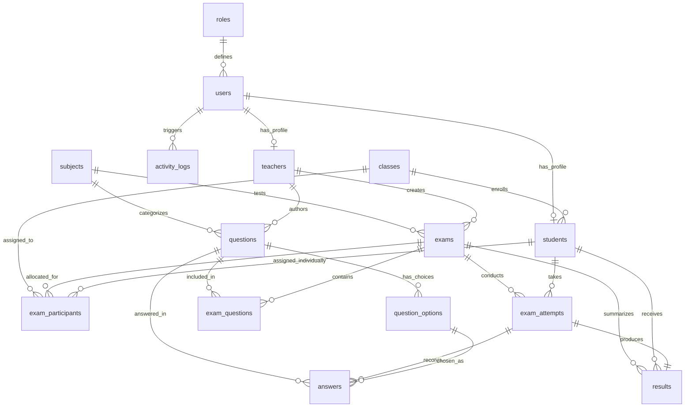

# RANCANGAN 15 TABEL DATABASE & ERD (MYSQL / MARIADB)
TAHAP 1 — BLUEPRINT SKEMA LENGKAP & RELASI ENTITAS (POIN 13 & 14)

> [!NOTE]
> Sesuai **Aturan AI_RULES.md (Tahap 1)**: Dokumen ini murni spesifikasi perancangan skema. **DILARANG** membuat migration, menjalankan DDL, atau mengotak-atik database fisik pada tahap ini.

---

## 13. SPESIFIKASI RINCI 15 TABEL DATABASE

### 1. Tabel: `roles`
- **Fungsi**: Mendefinisikan peran hak akses pengguna dalam sistem.
- **Primary Key**: `id` (INT UNSIGNED, AUTO_INCREMENT)
- **Foreign Key**: Tidak ada.
- **Field Penting**:
  - `name` (VARCHAR(32), UNIQUE, NOT NULL) — contoh: 'admin', 'teacher', 'student'
  - `display_name` (VARCHAR(64), NOT NULL)
  - `description` (VARCHAR(255), NULL)
- **Relasi**: Dihubungkan ke tabel `users` (One-to-Many).

### 2. Tabel: `users`
- **Fungsi**: Menyimpan akun otentikasi login seluruh pengguna sistem.
- **Primary Key**: `id` (BIGINT UNSIGNED, AUTO_INCREMENT)
- **Foreign Key**: `role_id` (INT UNSIGNED, REFERENCES `roles.id`)
- **Field Penting**:
  - `username` (VARCHAR(64), UNIQUE, NOT NULL) — NISN/NIP/Username
  - `password_hash` (VARCHAR(255), NOT NULL) — Hash Bcrypt/Argon2
  - `name` (VARCHAR(128), NOT NULL)
  - `role_id` (INT UNSIGNED, NOT NULL)
  - `is_active` (TINYINT(1), DEFAULT 1)
  - `created_at`, `updated_at` (TIMESTAMP)
- **Relasi**: Induk dari `students`, `teachers`, `activity_logs`, dan `exam_attempts`.

### 3. Tabel: `students`
- **Fungsi**: Menyimpan data identitas spesifik siswa (profil akademik).
- **Primary Key**: `id` (BIGINT UNSIGNED, AUTO_INCREMENT)
- **Foreign Key**:
  - `user_id` (BIGINT UNSIGNED, UNIQUE, REFERENCES `users.id` ON DELETE CASCADE)
  - `class_id` (INT UNSIGNED, REFERENCES `classes.id`)
- **Field Penting**:
  - `nis` (VARCHAR(32), UNIQUE, NOT NULL) — Nomor Induk Siswa
  - `nisn` (VARCHAR(32), NULL) — Nomor Induk Siswa Nasional
  - `gender` (ENUM('L', 'P'), NOT NULL)
- **Relasi**: Anak dari `users` (1-to-1) dan anak dari `classes` (Many-to-1).

### 4. Tabel: `teachers`
- **Fungsi**: Menyimpan data identitas pengajar/guru pembuat soal.
- **Primary Key**: `id` (BIGINT UNSIGNED, AUTO_INCREMENT)
- **Foreign Key**: `user_id` (BIGINT UNSIGNED, UNIQUE, REFERENCES `users.id` ON DELETE CASCADE)
- **Field Penting**:
  - `nip` (VARCHAR(32), UNIQUE, NULL) — Nomor Induk Pegawai
  - `phone` (VARCHAR(20), NULL)
- **Relasi**: Anak dari `users` (1-to-1), induk dari `questions` dan `exams` yang dibuatnya.

### 5. Tabel: `classes`
- **Fungsi**: Menyimpan data rombongan belajar / ruang kelas.
- **Primary Key**: `id` (INT UNSIGNED, AUTO_INCREMENT)
- **Foreign Key**: Tidak ada.
- **Field Penting**:
  - `name` (VARCHAR(64), NOT NULL) — contoh: "9A", "8B"
  - `level` (VARCHAR(16), NOT NULL) — jenjang "7", "8", "9"
  - `academic_year` (VARCHAR(16), NOT NULL) — contoh: "2026/2027"
- **Relasi**: Induk dari `students` dan target alokasi di `exam_participants`.

### 6. Tabel: `subjects`
- **Fungsi**: Master data mata pelajaran sekolah.
- **Primary Key**: `id` (INT UNSIGNED, AUTO_INCREMENT)
- **Foreign Key**: Tidak ada.
- **Field Penting**:
  - `code` (VARCHAR(32), UNIQUE, NOT NULL) — contoh: "MAT-9"
  - `name` (VARCHAR(128), NOT NULL) — contoh: "Matematika"
- **Relasi**: Induk dari bank soal pada tabel `questions` dan paket ujian `exams`.

### 7. Tabel: `questions`
- **Fungsi**: Menyimpan butir-butir pertanyaan soal ujian.
- **Primary Key**: `id` (BIGINT UNSIGNED, AUTO_INCREMENT)
- **Foreign Key**:
  - `subject_id` (INT UNSIGNED, REFERENCES `subjects.id`)
  - `created_by` (BIGINT UNSIGNED, REFERENCES `teachers.id`)
- **Field Penting**:
  - `question_type` (ENUM('single_choice', 'multiple_choice', 'essay'), NOT NULL)
  - `content` (TEXT, NOT NULL) — Teks soal
  - `media_path` (VARCHAR(255), NULL) — Tautan file gambar
  - `score_weight` (DECIMAL(5,2), DEFAULT 1.00) — Bobot poin
- **Relasi**: Induk dari `question_options`, dihubungkan ke `exams` via `exam_questions`.

### 8. Tabel: `question_options`
- **Fungsi**: Menyimpan pilihan opsi jawaban untuk soal pilihan ganda.
- **Primary Key**: `id` (BIGINT UNSIGNED, AUTO_INCREMENT)
- **Foreign Key**: `question_id` (BIGINT UNSIGNED, REFERENCES `questions.id` ON DELETE CASCADE)
- **Field Penting**:
  - `option_label` (VARCHAR(8), NOT NULL) — "A", "B", "C", "D", "E"
  - `content` (TEXT, NOT NULL) — Teks pilihan
  - `media_path` (VARCHAR(255), NULL) — Gambar pada opsi
  - `is_correct` (TINYINT(1), NOT NULL DEFAULT 0) — **SERVER ONLY (ISOLASI KUNCI)**
- **Relasi**: Anak dari `questions` (Many-to-1), target referensi jawaban di `answers`.

### 9. Tabel: `exams`
- **Fungsi**: Menyimpan paket dan sesi pelaksanaan jadwal ujian.
- **Primary Key**: `id` (BIGINT UNSIGNED, AUTO_INCREMENT)
- **Foreign Key**:
  - `subject_id` (INT UNSIGNED, REFERENCES `subjects.id`)
  - `created_by` (BIGINT UNSIGNED, REFERENCES `users.id`)
- **Field Penting**:
  - `title` (VARCHAR(128), NOT NULL) — contoh: "PAS Ganjil IPA 9"
  - `duration_minutes` (INT, NOT NULL) — Durasi ujian (menit)
  - `token` (VARCHAR(16), NULL) — Token proktor
  - `start_window` (DATETIME, NOT NULL) — Waktu awal ujian dibuka
  - `end_window` (DATETIME, NOT NULL) — Batas akhir penutupan sesi
  - `shuffle_questions` (TINYINT(1), DEFAULT 1) — Pengacakan nomor butir
  - `shuffle_options` (TINYINT(1), DEFAULT 1) — Pengacakan urutan opsi
  - `status` (ENUM('draft', 'published', 'active', 'completed'), DEFAULT 'draft')
- **Relasi**: Induk dari `exam_questions`, `exam_participants`, dan `exam_attempts`.

### 10. Tabel: `exam_questions`
- **Fungsi**: Tabel pivot penyusun paket butir soal ke dalam suatu ujian.
- **Primary Key**: `id` (BIGINT UNSIGNED, AUTO_INCREMENT)
- **Foreign Key**:
  - `exam_id` (BIGINT UNSIGNED, REFERENCES `exams.id` ON DELETE CASCADE)
  - `question_id` (BIGINT UNSIGNED, REFERENCES `questions.id`)
- **Field Penting**:
  - `order_index` (INT, DEFAULT 0)
  - `UNIQUE KEY uk_exam_question (exam_id, question_id)`
- **Relasi**: Relasi Many-to-Many antara `exams` dan `questions`.

### 11. Tabel: `exam_participants`
- **Fungsi**: Menentukan alokasi kelas atau siswa yang diizinkan mengikuti ujian.
- **Primary Key**: `id` (BIGINT UNSIGNED, AUTO_INCREMENT)
- **Foreign Key**:
  - `exam_id` (BIGINT UNSIGNED, REFERENCES `exams.id` ON DELETE CASCADE)
  - `class_id` (INT UNSIGNED, NULL, REFERENCES `classes.id`)
  - `student_id` (BIGINT UNSIGNED, NULL, REFERENCES `students.id`)
- **Field Penting**:
  - `allow_retest` (TINYINT(1), DEFAULT 0)
- **Relasi**: Many-to-Many antara `exams`, `classes`, dan `students`.

### 12. Tabel: `exam_attempts`
- **Fungsi**: Merekam sesi pengerjaan langsung tiap peserta pada suatu ujian.
- **Primary Key**: `id` (BIGINT UNSIGNED, AUTO_INCREMENT)
- **Foreign Key**:
  - `exam_id` (BIGINT UNSIGNED, REFERENCES `exams.id`)
  - `student_id` (BIGINT UNSIGNED, REFERENCES `students.id`)
- **Field Penting**:
  - `started_at` (DATETIME, NOT NULL) — Waktu server saat peserta mulai
  - `ends_at` (DATETIME, NOT NULL) — **Waktu Akhir Aktual Peserta** (di-set `MIN(started_at + duration, exam.end_window)` saat mulai; dapat diperpanjang manual oleh Admin jika ada kendala teknis)
  - `submitted_at` (DATETIME, NULL) — Waktu selesai pengerjaan
  - `status` (ENUM('in_progress', 'submitted', 'timeout', 'blocked'), DEFAULT 'in_progress')
  - `ip_address` (VARCHAR(45), NULL)
  - `device_info` (VARCHAR(255), NULL)
  - `UNIQUE KEY uk_exam_student (exam_id, student_id)` — Mencegah multiple attempt
- **Relasi**: Induk dari `answers` dan `results`.

### 13. Tabel: `answers` (Jawaban Peserta)
- **Fungsi**: Menyimpan pilihan/jawaban aktual siswa per butir soal (**Kritis & Konkurensi Tinggi**).
- **Primary Key**: `id` (BIGINT UNSIGNED, AUTO_INCREMENT)
- **Foreign Key**:
  - `attempt_id` (BIGINT UNSIGNED, REFERENCES `exam_attempts.id` ON DELETE CASCADE)
  - `question_id` (BIGINT UNSIGNED, REFERENCES `questions.id`)
  - `selected_option_id` (BIGINT UNSIGNED, NULL, REFERENCES `question_options.id` ON DELETE SET NULL)
- **Field Penting**:
  - `selected_option` (VARCHAR(8), NULL) — label opsi 'A', 'B', dsb.
  - `essay_answer` (LONGTEXT, NULL)
  - `is_marked` / `is_flagged` (TINYINT(1), DEFAULT 0) — Tanda ragu-ragu
  - `is_correct` (TINYINT(1), NULL) — Nilai evaluasi auto-grading
  - `earned_score` (DECIMAL(5,2), DEFAULT 0.00)
  - `answered_at` (DATETIME, NULL) — Waktu aktual saat dijawab
  - `synced_at` (TIMESTAMP, NULL) — Waktu sinkronisasi ACK server
  - `UNIQUE KEY uk_attempt_question (attempt_id, question_id)` — **Atomic Upsert Key**
- **Relasi**: Anak dari `exam_attempts` (Many-to-1).

### 14. Tabel: `results`
- **Fungsi**: Menyimpan rekapitulasi nilai akhir peserta per ujian (idempotent result record).
- **Primary Key**: `id` (BIGINT UNSIGNED, AUTO_INCREMENT)
- **Foreign Key**:
  - `attempt_id` (BIGINT UNSIGNED, UNIQUE, REFERENCES `exam_attempts.id` ON DELETE CASCADE)
  - `exam_id` (BIGINT UNSIGNED, REFERENCES `exams.id`)
  - `student_id` (BIGINT UNSIGNED, REFERENCES `students.id`)
- **Field Penting**:
  - `correct_count` (INT, DEFAULT 0) — Jumlah jawaban benar
  - `wrong_count` (INT, DEFAULT 0) — Jumlah jawaban salah
  - `unanswered_count` (INT, DEFAULT 0) — Jumlah tidak terjawab
  - `mc_score` (DECIMAL(5,2), DEFAULT 0.00) — Nilai Pilihan Ganda
  - `essay_score` (DECIMAL(5,2), DEFAULT 0.00) — Nilai Esai
  - `score` / `final_score` (DECIMAL(5,2), NOT NULL) — Nilai Akhir (0 - 100)
  - `status` (VARCHAR(32), DEFAULT 'completed')
  - `is_published` (TINYINT(1), DEFAULT 0) — Tampil ke siswa
  - `graded_at` (TIMESTAMP, NULL)
- **Relasi**: 1-to-1 dengan `exam_attempts`.

### 15. Tabel: `activity_logs`
- **Fungsi**: Merekam audit trail aktivitas penting (login, submit, reset, backup, perpanjangan waktu, event anti-cheat) tanpa menyimpan data sensitif.
- **Primary Key**: `id` (BIGINT UNSIGNED, AUTO_INCREMENT)
- **Foreign Key**: `user_id` (BIGINT UNSIGNED, NULL, REFERENCES `users.id`)
- **Field Penting**:
  - `action` (VARCHAR(64), NOT NULL) — contoh: 'RESET_LOGIN', 'TIME_EXTENDED', 'APP_BACKGROUNDED', 'WINDOW_FOCUS_LOST', 'SUBMIT_EXAM'
  - `module` (VARCHAR(32), NOT NULL)
  - `ip_address` (VARCHAR(45), NOT NULL)
  - `details` (TEXT, NULL) — mencatat rincian non-sensitif (misal: "Admin memperpanjang waktu attempt #849 selama 15 menit: kendala baterai HP")
  - `created_at` (TIMESTAMP, DEFAULT CURRENT_TIMESTAMP)
- **Relasi**: Log audit umum pengguna.

---

## 14. ENTITY RELATIONSHIP DIAGRAM (MERMAID ERD)

