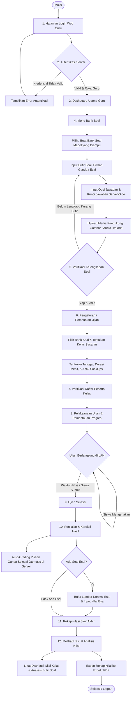

# FLOWCHART GURU SISTEM CBT
TAHAP 1 — BLUEPRINT ALUR KERJA LENGKAP GURU

Dokumen ini memetakan alur kerja Guru secara lengkap mulai dari login ke sistem, penyusunan bank soal, pengaturan jadwal ujian mata pelajaran, pemantauan pelaksanaan, koreksi soal esai, hingga rekapitulasi dan peninjauan hasil akhir ujian.

---

## 1. DIAGRAM ALUR UTAMA (FLOWCHART MERMAID)

---

## 2. PENJELASAN SETIAP TAHAPAN ALUR GURU

### 1. Login
- Guru membuka antarmuka Web melalui browser di laptop/PC yang terhubung ke jaringan sekolah (`http://localhost:8000` atau IP server lokal).
- Memasukkan `Username / NIP` dan `Password`.

### 2. Authentication
- Server memverifikasi kecocokan kredensial hash di database MySQL (**Aturan 15 AI_RULES.md**).
- Server memastikan pengguna memiliki `role = 'teacher'` (Guru) dan membatasi akses hanya ke mata pelajaran serta kelas yang diampunya.

### 3. Dashboard Guru
- Menyajikan ringkasan informasi yang relevan untuk guru:
  - Jumlah bank soal aktif yang telah dibuat.
  - Jadwal ujian mapel guru yang akan datang atau sedang aktif hari ini.
  - Notifikasi jumlah lembar jawaban esai siswa yang belum dikoreksi.

### 4. Kelola Bank Soal
- Guru membuka menu **Bank Soal**:
  - Membuat wadah paket soal (misal: "Bank Soal Matematika Kelas 9 PAS").
  - Menambahkan butir-butir soal:
    - **Pilihan Ganda**: Mengetik pertanyaan, memasukkan pilihan opsi (A, B, C, D, E), menentukan bobot skor, dan menandai opsi jawaban yang benar (kunci jawaban disimpan eksklusif di server sesuai **Aturan 11**).
    - **Esai**: Mengetik pertanyaan esai dan menentukan pedoman penskoran serta bobot maksimal.
  - Mengunggah berkas gambar/media pendukung soal (misal: grafik, peta, diagram, rumus matematika).
  - Atau melakukan *Import Bank Soal* secara massal via template Excel yang disediakan sistem.

### 5. Verifikasi Kelengkapan Soal
- Guru meninjau pratampil (*preview*) butir-butir soal untuk memastikan tidak ada kesalahan ketik, gambar tampil sempurna, bobot poin pas, dan seluruh butir telah memiliki kunci jawaban yang valid.

### 6. Pengaturan / Pembuatan Ujian (Ujian)
- Guru membuat jadwal penilaian untuk mata pelajarannya:
  - Menghubungkan paket ujian dengan bank soal yang telah diverifikasi.
  - Menentukan nama ujian (misal: "Asesmen Sumatif Tengah Semester IPA").
  - Mengatur durasi pengerjaan dalam menit (misal: 60 menit atau 90 menit).
  - Mengaktifkan opsi pengacakan urutan soal dan pengacakan susunan pilihan ganda.

### 7. Verifikasi Peserta (Peserta)
- Guru memeriksa daftar peserta dari rombongan belajar / kelas yang diajarnya (mode *read-only*) untuk memastikan seluruh siswa aktif terdaftar di sistem.

### 8. Pelaksanaan Ujian & Pemantauan Progres
- Saat jadwal ujian dibuka oleh proktor/admin, guru dapat melihat progres pengerjaan siswa untuk mata pelajarannya:
  - Berapa banyak siswa yang sudah mulai mengerjakan.
  - Siapa saja siswa yang sedang aktif atau sudah menyelesaikan ujian.

### 9. Ujian Selesai
- Sesi pengerjaan siswa berakhir baik melalui penekanan tombol "Selesai" di Android (idempotent submit) maupun melalui penutupan otomatis batas waktu server (*timeout force submit* sesuai **Aturan 12**).

### 10. Penilaian & Koreksi Hasil
- **Pilihan Ganda**: Server secara otomatis menghitung nilai (*auto-grading*) dalam hitungan detik setelah submit berhasil.
- **Soal Esai**: Jika ujian memiliki tipe soal esai, guru membuka menu koreksi untuk membaca jawaban esai siswa per nomor dan memberikan skor secara manual.

### 11. Rekapitulasi Skor Akhir
- Server secara otomatis menggabungkan skor pilihan ganda dengan skor esai yang telah diinput guru, lalu mengalkulasi nilai akhir berdasarkan bobot total (skala 0 - 100).

### 12. Melihat Hasil & Analisis Nilai (Hasil)
- Guru meninjau rekapitulasi nilai lengkap seluruh siswa di kelas yang diampunya:
  - Nilai tertinggi, terendah, dan rata-rata kelas.
  - Analisis butir soal (mengetahui nomor soal mana yang paling banyak dijawab salah oleh siswa).
  - Mengunduh rekapitulasi nilai ke dalam format **Excel (.xlsx)** untuk keperluan pengolahan nilai rapor.
- Guru mengakhiri sesi kerja dengan aman (*Logout*).
